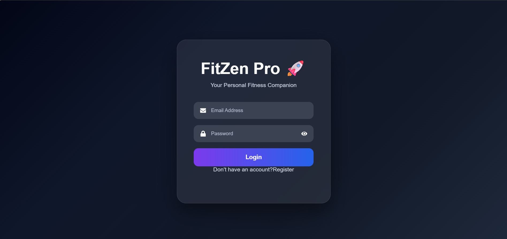
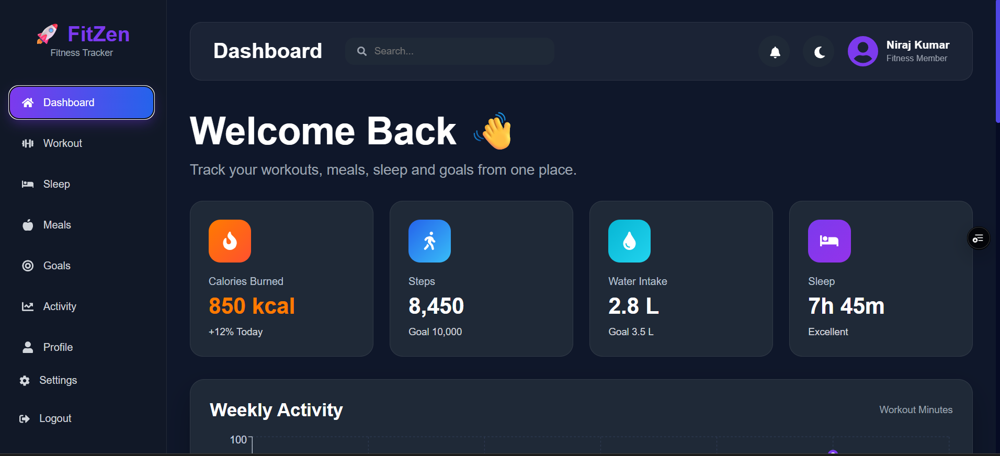
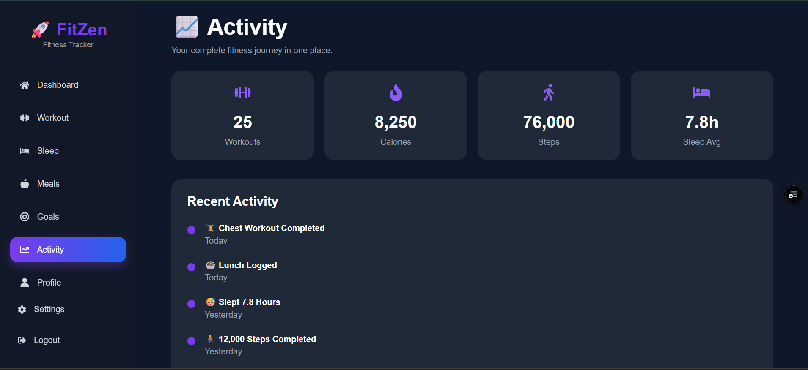
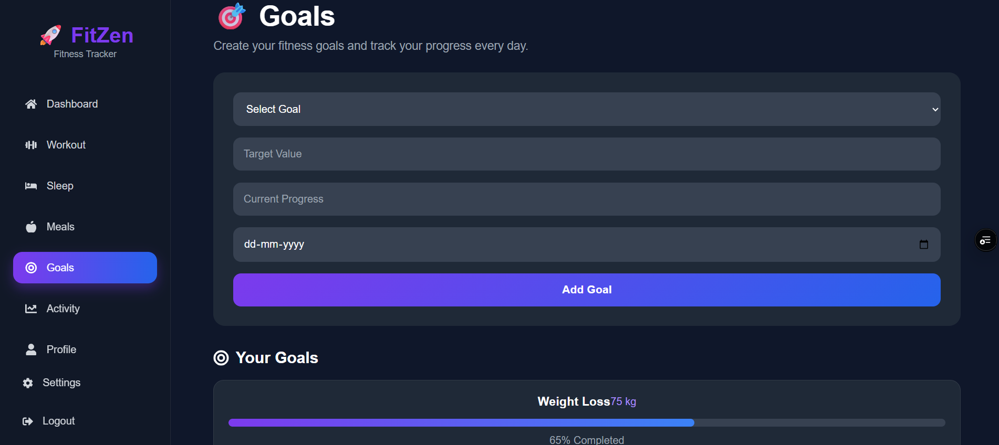

<div align="center">


### Your Personal Fitness Companion 💪

A full-stack fitness tracking platform — workouts, meals, sleep, water, and goals — in one clean dashboard.

[](https://fit-zen-pro.vercel.app)
[](https://fitzen-pro.onrender.com)

<br/>


</div>

<br/>

## 📖 Overview

FitZen Pro is a secure, responsive fitness tracker built to replace the "one app per habit" problem. Instead of juggling separate apps for workouts, meals, sleep, and goals, everything lives on one dashboard, backed by JWT-authenticated REST APIs and a MySQL database.

**Frontend** (React + Vite) and **backend** (Spring Boot + Spring Security) run as independent services, communicating over REST — a clean, cloud-deployable, production-style architecture.

## ❓ Why FitZen Pro

| Problem | FitZen Pro's Answer |
|----|----|
| Fitness data scattered across multiple apps | One dashboard for workouts, meals, sleep, water & goals |
| Weak or session-based auth in hobby projects | Real JWT auth + Spring Security + BCrypt password hashing |
| Static, table-heavy trackers | Interactive charts, progress bars, animated dashboard |
| Frontend/backend tightly coupled | Fully decoupled React SPA ↔ Spring Boot REST API |

## ✨ Features

<table>
<tr>
<td valign="top" width="50%">

**🔐 Authentication**
- JWT-based login & registration
- BCrypt password encryption
- Spring Security–protected routes

**📊 Dashboard**
- Weekly activity graph
- Water intake progress
- Sleep summary & calories burned
- Steps counter, daily goals

**💪 Workouts**
- Log workouts by category
- Exercise history
- Daily progress tracking

</td>
<td valign="top" width="50%">

**🍎 Meals**
- Meal logging & calorie tracking
- Daily nutrition records

**😴 Sleep**
- Sleep hours & quality logging
- Sleep statistics

**🎯 Goals**
- Create & track fitness goals
- Visual progress bars

**👤 Profile & ⚙️ Settings**
- Editable profile, theme preferences, secure logout

</td>
</tr>
</table>

## 🖥️ Preview

<div align="center">

| Login | Dashboard |
|:---:|:---:|
|  |  |

| Weekly Activity | Goal Tracking |
|:---:|:---:|
|  |  |

</div>

## 🛠️ Tech Stack

| Layer | Stack |
|---|---|
| **Frontend** | React 19, Vite, React Router, Axios, CSS |
| **Backend** | Spring Boot 3, Spring Security, JWT, Maven |
| **Database** | MySQL |
| **Deployment** | Vercel (frontend) · Render (backend) |

## 🚀 Getting Started

```bash
# Clone
git clone https://github.com/Nicode2707/FitZen-Pro.git

# Frontend
cd FitZen-Pro/Frontend/fitzen-frontend
npm install
npm run dev

# Backend (in a new terminal)
cd FitZen-Pro/backend/fitzen-backend
mvn spring-boot:run
```

Set your MySQL credentials and JWT secret in `application.properties` (backend) and your API base URL in `.env` (frontend) before running.

## 🌐 Live Demo

- **Frontend:** [fit-zen-pro.vercel.app](https://fit-zen-pro.vercel.app)
- **Backend API:** [fitzen-pro.onrender.com](https://fitzen-pro.onrender.com)

## 👨‍💻 Author

**Niraj Kumar** — Java Developer, JIS College of Engineering
[GitHub @Nicode2707](https://github.com/Nicode2707)

<div align="center">

⭐ **If FitZen Pro helped you, consider giving it a star!** ⭐

</div>
